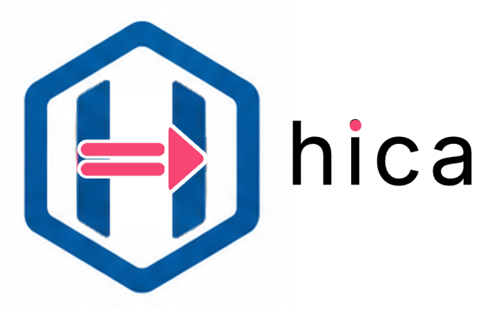

<div align="center">
  
  <p><b>A safe, expression-oriented, functional-flavored language with a gentle learning curve</b></p>
  
</div>

**hica** is a safe, expression-oriented, functional-flavored language with a gentle learning curve.
It is built in [Koka](https://koka-lang.github.io/) and transpiles to Koka, powered by Koka's
algebraic effect system and Perceus reference counting. Because the target is Koka itself,
hica programs can be compiled onward to C, JavaScript, or WASM.

hica is a good name for this language and it can stand for **H**indley-milner **I**nference **C**ompiler with **A**lgebraic effects

Visit hica's [website](https://www.hica.dev/) for a tour of the language.

## Design Goals

- **Safe by default** – no null, no unhandled exceptions; errors are values (`Result`, `Maybe`).
- **Expression-oriented** – everything returns a value: `if`, `match`, and blocks are all expressions.
- **Functional-flavored** – immutability by default, higher-order functions, and pattern matching at the core.
- **Gentle learning curve** – Hindley-Milner type inference means you rarely write annotations; the language gets out of your way.
- **Effect tracking** – side effects (I/O, state, exceptions) are tracked by the type system, not buried in function bodies.
- **No garbage collector** – memory safety via Koka's Perceus reference counting, with no GC pauses.
- **Familiar syntax** – curly braces, `let`, `fun`, `match`, `if`, and the `=>` expression-bodied shorthand.

## Compilation Pipeline

```
.hc source → Lex → Parse → Desugar → Type Check → Emit Koka (.kk) → Koka Compiler → C/JS/WASM
```

Each phase is implemented as a Koka module using algebraic effects for compiler
state (diagnostics, fresh type variables, symbol scopes).

## Technical Stack

| Component             | Approach                                        |
| --------------------- | ----------------------------------------------- |
| Implementation        | Koka 3.x                                        |
| Parsing               | Recursive descent with Pratt expression parsing |
| Type system           | Hindley-Milner with unification                  |
| Name resolution       | Declaration-aware marshalling (`hc_` prefix)     |
| CLI argument parsing  | klap (clap-inspired, in-tree)                    |
| Memory management     | Perceus (inherited from Koka target)             |
| Backend target        | Koka (.kk) → C / JS / WASM via Koka              |
| Runtime               | Koka standard library and runtime                |

## Install

**Linux / macOS / Chromebook:**

```sh
curl -fsSL https://www.hica.dev/install.sh | sh
```

This installs the latest release binary to `~/.local/bin`. Override with `HICA_INSTALL_DIR`:

```sh
curl -fsSL https://www.hica.dev/install.sh | HICA_INSTALL_DIR=/usr/local/bin sh
```

**Windows (PowerShell):**

```powershell
irm https://www.hica.dev/install.ps1 | iex
```

### Build from source

Requires [Koka](https://koka-lang.github.io/koka/doc/book.html#install) ≥ 3.2.

```sh
git clone https://github.com/cladam/hica.git
cd hica
make release
```

## Quick Start

```sh
# Compile and run a Hica source file
./hica run examples/hello.hc

# Just compile (outputs .kk alongside source)
./hica build examples/arrow.hc

# Type-check without emitting
./hica check examples/hello.hc
```

## Examples

### Expression-bodied functions

```rust
fun double(x) => x * 2

fun main() {
  let result = double(21)
  result
}
```

### If / else-if chains

```rust
fun fizzbuzz(n) =>
  if n % 15 == 0 { "fizzbuzz" }
  else if n % 3 == 0 { "fizz" }
  else if n % 5 == 0 { "buzz" }
  else { show(n) }
```

### Match expressions

```rust
fun describe(x) => match x {
  0 => "zero",
  1 => "one",
  _ => "many"
}
```

### Lambdas

```rust
fun apply(f, x) => f(x)

fun main() {
  let sq = (n) => n * n
  apply(sq, 5)
}
```

### Type annotations

```rust
fun add(a: int, b: int) : int => a + b

fun main() {
  let x: int = 42
  println(add(x, 8))
}
```

### Maybe and Result types

```rust
fun safe_divide(a, b) =>
  if b == 0 { Err("division by zero") }
  else { Ok(a / b) }

fun main() {
  match safe_divide(10, 3) {
    Ok(n)  => println(n),
    Err(e) => println(e)
  }
}
```

## CLI

```
$ hica --help

Usage: hica [OPTIONS] [COMMAND] [FILE]
The hica compiler

Options:
      --check            Check formatting without modifying the file
      --cache            Remove the stdlib cache (~/.hica/stdlib)
      --target=TARGET    Output target: koka (default) or js
  -o, --output=OUTPUT    Output binary name (build only)
      --help                 display this help and exit
      --version              output version information and exit

Commands:
  build, b               Compile a .hc file and build a binary
  run, r                 Compile and run a .hc file
  check, c               Analyse a .hc file and report errors
  fmt, f                 Format a .hc file
  clean                  Remove generated build artifacts
  test, t                Run tests in a .hc file
  new                    Create a new hica project
  init                   Initialise a hica project in the current directory
  add                    Add a dependency
  remove                 Remove a dependency
  fetch                  Fetch all dependencies
  repl                   Start an interactive REPL
  help                   Show help for a command
```

## Inspirations

- [Koka](https://koka-lang.github.io/) – language with algebraic effects and
  Perceus memory management
- [Rust](https://www.rust-lang.org/) – syntax, safety mindset, and the `match` expression
- [F#](https://fsharp.org/) – functional-first style, pipelines, and type inference ergonomics
- C# – the `=>` expression-bodied shorthand and query syntax
- Python – approachable, expressive lists and comprehensions

## Licence

Apache License 2.0 – see [LICENSE](LICENSE).
