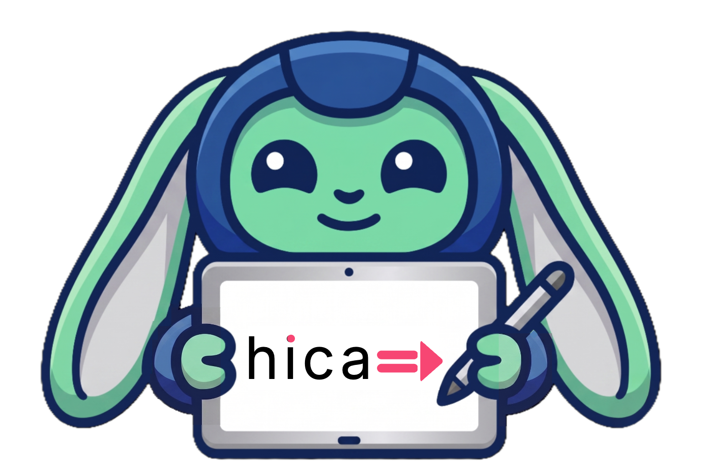

# hica for Kids: The Language with the Magic Arrow `=>`

Welcome to **hica**! hica is a programming language designed to be fast like a
racing car but easy to read like a story. It's built using **Koka** and turns
your code into **C**, the same language used to build the world's most powerful
software.

You'll find more information about hica on its main **[web page](https://www.hica.dev/)**