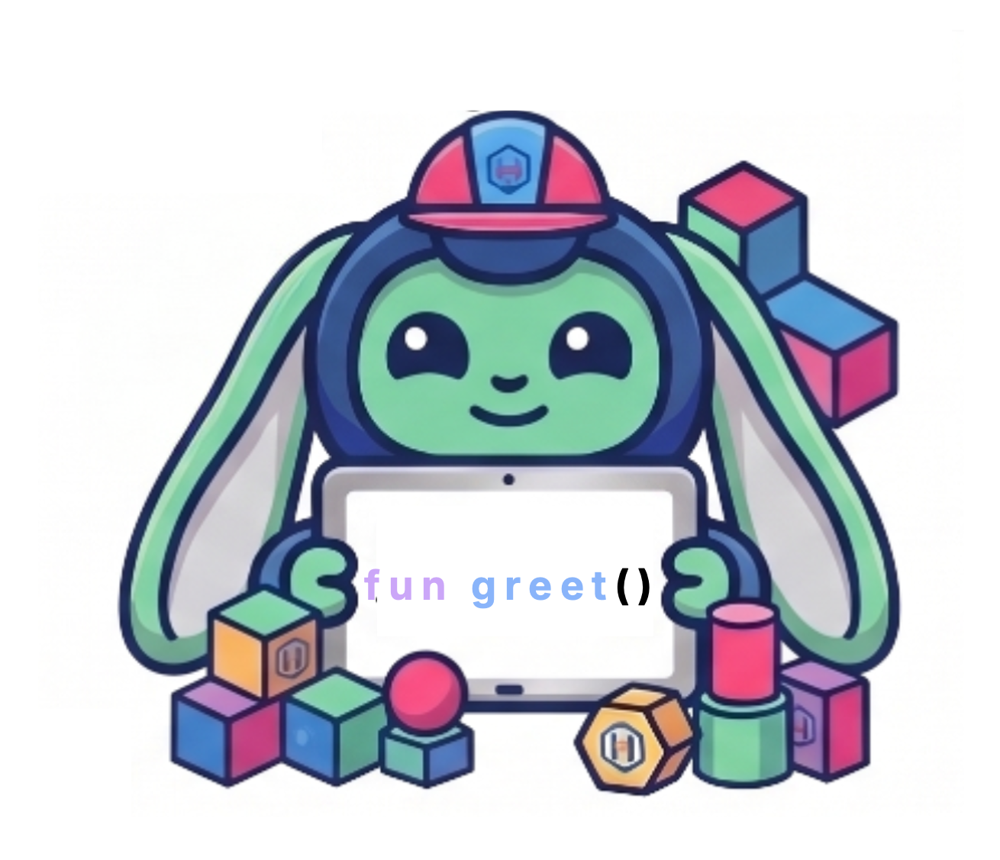

## World 2: Building Machines

> Now you know the basics. Time to build! In this world you'll create
> functions (little machines), test them, and make your programs smart
> enough to choose different paths. You're becoming a real engineer!
