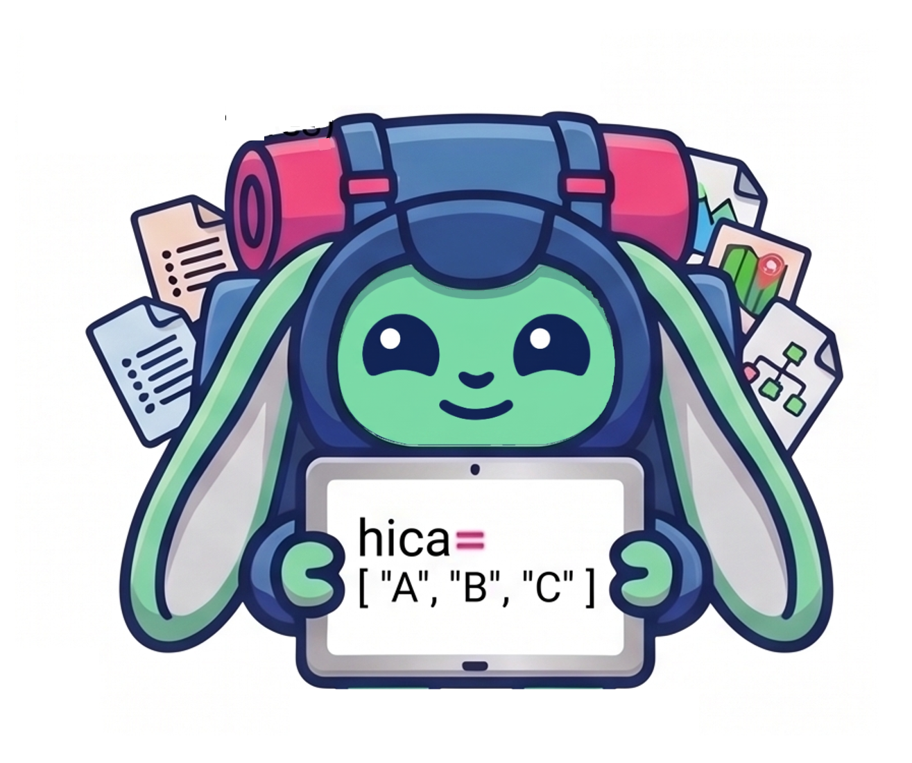

## 🎒 World 4: The Ultimate Data Backpack

> Every adventurer needs a backpack! In this world you'll learn about
> collections. Tuples, lists, maybe, results, and maps. These are the
> containers that hold your data as your programs grow bigger.

